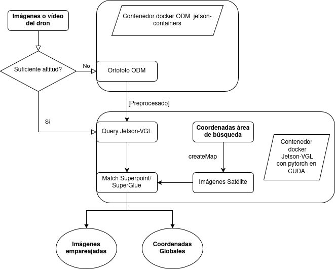
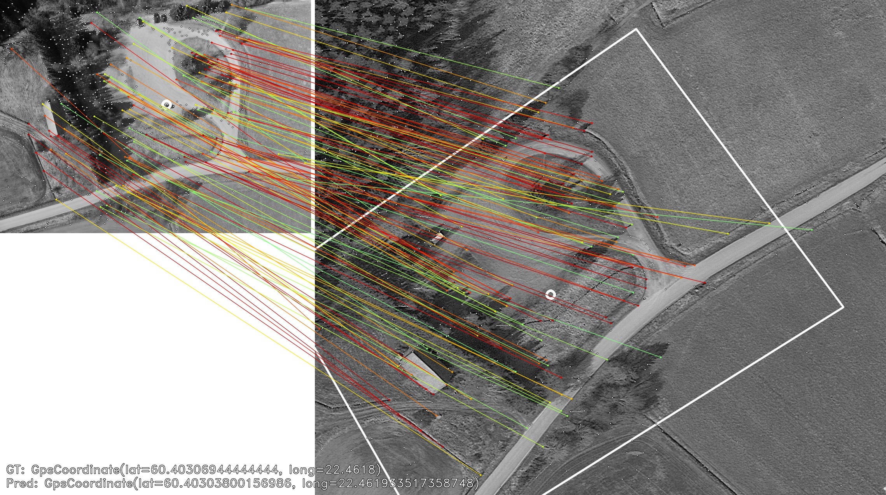
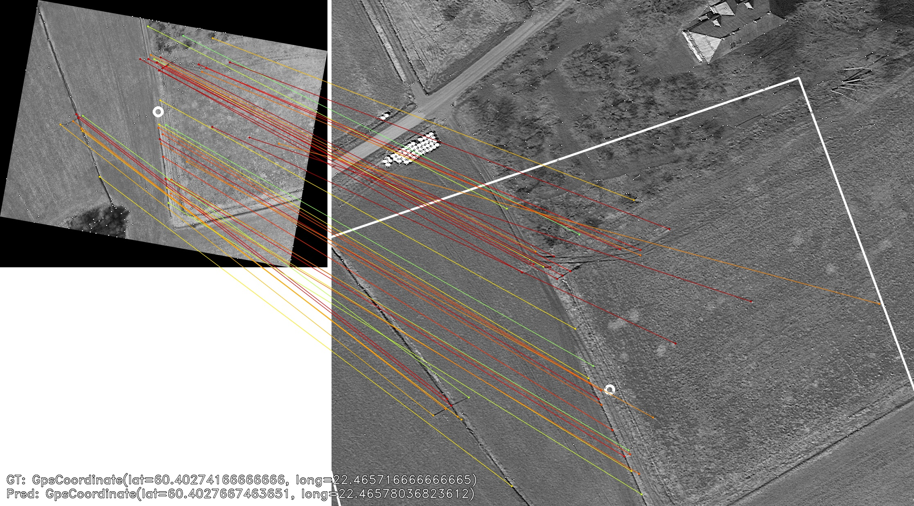

# Visual Geolocalization from Aerial Images on NVIDIA Jetson Orin Nano

This repository provides a comprehensive solution for GPS-free localization using aerial images captured at any altitude. The system integrates OpenDroneMap (ODM) for orthophoto generation and advanced visual geolocalization techniques using deep learning algorithms.

## Table of Contents
- [Visual Geolocalization from Aerial Images on NVIDIA Jetson Orin Nano](#visual-geolocalization-from-aerial-images-on-nvidia-jetson-orin-nano)
	- [Table of Contents](#table-of-contents)
	- [Overview](#overview)
	- [Architecture](#architecture)
		- [Example Results](#example-results)
	- [Requirements](#requirements)
		- [System Requirements](#system-requirements)
		- [Platform-Specific Requirements](#platform-specific-requirements)
		- [API Requirements](#api-requirements)
	- [Installation](#installation)
	- [Usage](#usage)
		- [High Altitude Mode (GSD \> 20cm)](#high-altitude-mode-gsd--20cm)
		- [Low Altitude Mode (GSD ≤ 20cm)](#low-altitude-mode-gsd--20cm)
		- [Interactive Prompts](#interactive-prompts)
	- [Configuration](#configuration)
		- [Environment Variables](#environment-variables)
		- [Directory Structure](#directory-structure)
		- [Supported Image Formats](#supported-image-formats)
		- [Test run](#test-run)
	- [Technical Details](#technical-details)
		- [OpenDroneMap Integration](#opendronemap-integration)
		- [Visual Localization Pipeline](#visual-localization-pipeline)
	- [Troubleshooting](#troubleshooting)
		- [Common Issues](#common-issues)
		- [Performance Optimization](#performance-optimization)
	- [Acknowledgments](#acknowledgments)
	- [References](#references)
	- [License](#license)

## Overview

This project enables precise visual geolocalization for UAVs without GPS dependency by leveraging:

- **OpenDroneMap (ODM)**: For processing low-altitude imagery into georeferenced orthophotos
- **Visual Localization**: Deep learning-based matching using SuperPoint and SuperGlue algorithms
- **Satellite Integration**: Automatic satellite image downloading and stitching via MapTiler API
- **Dual Processing Modes**: Optimized workflows for different flight altitudes and Ground Sample Distance (GSD)

The system automatically determines the appropriate processing pipeline based on image characteristics and altitude, making it suitable for various UAV applications including search and rescue, surveying, and autonomous navigation.

## Architecture

The visual localization system consists of three main components:

1. **Key Point Detection and Description**: Detects and describes distinctive features in both query images and satellite reference data
2. **Key Point Matching**: Establishes correspondences between query and reference images using advanced neural networks
3. **Pose Estimation**: Calculates precise UAV position within the georeferenced satellite database



### Example Results

**Sparse Keypoint Matching**:

*Query image with matched keypoints against satellite imagery*

**Dense Feature Correspondence**:

*Detailed feature matching demonstration*

## Requirements

### System Requirements
- **Docker**: Latest version with GPU support (for CUDA acceleration)
- **Minimum RAM**: 8GB (16GB recommended for large datasets)
- **Storage**: Sufficient space for image processing (varies by dataset size)

### Platform-Specific Requirements

**For NVIDIA Jetson Orin Nano:**
- JetPack 6.2 or later
- jetson-containers framework
- Minimum 8GB RAM configuration

### API Requirements
- **MapTiler API Key**: Required for satellite image downloading
  - Set as environment variable: `export MAPTILER_API_KEY="your_api_key_here"`
  - Get your free API key at [MapTiler.com](https://www.maptiler.com/)

## Installation

1. **Clone the repository**:
   ```bash
   git clone <repository_url>
   cd vgl
   ```

2. **Set up MapTiler API Key**:
   ```bash
   export MAPTILER_API_KEY="your_maptiler_api_key"
   ```

3. **Make scripts executable**:
   ```bash
   chmod +x run.sh
   chmod +x run_jetson.sh  # For Jetson platforms
   ```

4. **Pull required Docker images**:
   ```bash
   docker pull ghcr.io/josehinojosahidalgo/jetson_vgl:1.0
   docker pull opendronemap/odm:gpu  # For GPU acceleration
   docker pull opendronemap/odm      # For CPU processing
   ```

## Usage

The script supports two distinct processing modes based on Ground Sample Distance (GSD):

### High Altitude Mode (GSD > 20cm)

For single images captured at high altitude where direct satellite matching is possible:

```bash
./run.sh <image_file>
```

**Example**:
```bash
./run.sh drone_image_high_alt.jpg
```

**Process Flow**:
1. Copies query image to VGL directory structure
2. Optionally downloads satellite images for the area of interest
3. Performs visual geolocalization using deep learning matching
4. Outputs localization results

### Low Altitude Mode (GSD ≤ 20cm)

For multiple images requiring ODM processing to create orthophotos:

```bash
./run.sh <gsd_value> <odm_directory>
```

**Example**:
```bash
./run.sh 15.5 /path/to/drone_images
```

**Requirements**:
- `<gsd_value>`: Ground Sample Distance in cm/pixel (must be ≤ 20)
- `<odm_directory>`: Directory containing drone images in `images/` subdirectory

**Process Flow**:
1. Validates GSD and directory structure
2. Runs OpenDroneMap to generate orthophoto
3. Converts orthophoto to PNG format
4. Offers option to review orthophoto before continuing
5. Proceeds with visual geolocalization on generated orthophoto

### Interactive Prompts

During execution, the script will prompt for:

**VGL Directory Setup**:
- Directory path for visual geolocalization data (default: `./vgl_data`)

**Satellite Image Download**:
- Whether to download new satellite images
- Bounding box coordinates (if downloading):
  - Top-Left Latitude/Longitude
  - Bottom-Right Latitude/Longitude
  - Stitch size parameter

**GPU Usage** (ODM mode):
- Whether to use GPU acceleration for SIFT feature extraction

## Configuration

### Environment Variables

```bash
# Required for satellite image download
export MAPTILER_API_KEY="your_api_key"

# Optional: Custom Docker registry
export VGL_REGISTRY="ghcr.io/josehinojosahidalgo"
```

### Directory Structure

The script automatically creates and manages the following structure:

```
vgl_data/
├── query/          # Input images for localization
├── map/            # Satellite reference images
└── output/         # Localization results and stitched images

odm_directory/
├── images/         # Input drone images (JPG, PNG, MP4)
└── odm_orthophoto/ # Generated orthophotos
    └── odm_orthophoto.tif
```

### Supported Image Formats

- **Input Images**: `.jpg`, `.jpeg`, `.png`, `.JPG`, `.JPEG`, `.PNG`
- **Video Files**: `.mp4`, `.MP4`
- **Output**: `.tif`, `.png`

### Test run

Run the following command with images in the ODM directory from [aukerman](https://github.com/OpenDroneMap/odm_data_aukerman/tree/master) dataset.

```bash
./run.sh 0.1 ./datasets/project --download-satellite --non-interactive \                                                                      ✔ │ 11m 24s │ 
    --top-left-lat 41.306734 --top-left-lon -81.757215 \
    --bottom-right-lat 41.302398 --bottom-right-lon -81.748911 --stitch-size 8
```
One match is expected as output.

## Technical Details

### OpenDroneMap Integration

**CPU Processing**:
```bash
docker run -ti --rm -v /datasets opendronemap/odm \
  --project-path /datasets <project> \
  --orthophoto-resolution=<gsd> \
  --fast-orthophoto \
  --skip-band-alignment \
  --skip-report
```

**GPU Acceleration**:
```bash
docker run -ti --rm -v /datasets --gpus all opendronemap/odm:gpu \
  --project-path /datasets <project> \
  --orthophoto-resolution=<gsd> \
  --fast-orthophoto \
  --skip-band-alignment \
  --skip-report
```

### Visual Localization Pipeline

The system uses state-of-the-art deep learning models:

- **SuperPoint**: Self-supervised keypoint detection and description
- **SuperGlue**: Graph neural network-based feature matching
- **Geometric Verification**: RANSAC-based pose estimation

**Processing Container**:
```bash
docker run --rm -v <data_dir>:/app/data \
  ghcr.io/josehinojosahidalgo/jetson_vgl:1.0 \
  poetry run python /app/scripts/main.py
```

## Troubleshooting

### Common Issues

**1. "Directory not found" errors**:
- Ensure the ODM directory exists and contains an `images/` subdirectory
- Verify image files are in supported formats

**2. "No images detected"**:
- Check file extensions match supported formats
- Ensure images are directly in the `images/` subdirectory

**3. Docker permission errors**:
```bash
sudo usermod -aG docker $USER
newgrp docker
```

**4. GPU not detected**:
- Install NVIDIA Container Toolkit
- Verify GPU support: `docker run --gpus all nvidia/cuda:11.0-base nvidia-smi`

**5. MapTiler API errors**:
- Verify API key is set: `echo $MAPTILER_API_KEY`
- Check API quota and billing status

### Performance Optimization

**For Large Datasets**:
- Use GPU acceleration when available
- Increase Docker memory limits if needed
- Consider processing in smaller batches

**Memory Management**:
```bash
# Increase Docker memory limit
docker system prune -f
```

## Acknowledgments

This project builds upon several outstanding open-source projects:

- **[OpenDroneMap](https://github.com/OpenDroneMap/ODM)**: Photogrammetry pipeline for drone imagery
- **[jetson-containers](https://github.com/dusty-nv/jetson-containers)**: NVIDIA Jetson container optimization
- **[visual_localization](https://github.com/TerboucheHacene/visual_localization)**: Core visual localization algorithms
- **[WildNav](https://github.com/TIERS/wildnav)**: Original research implementation
- **[SuperGlue](https://github.com/magicleap/SuperGluePretrainedNetwork)**: Feature matching neural networks

Special thanks to the research community for advancing the field of visual SLAM and localization.

## References

- Makela, J., et al. (2022). [Vision-based GNSS-Free Localization for UAVs in the Wild](https://arxiv.org/abs/2210.09727). *arXiv preprint*.
- DeTone, D., et al. (2018). [SuperPoint: Self-Supervised Interest Point Detection and Description](https://arxiv.org/abs/1712.07629). *CVPR Workshop*.
- Sarlin, P.E., et al. (2020). [SuperGlue: Learning Feature Matching with Graph Neural Networks](https://arxiv.org/abs/1911.11763). *CVPR*.

## License

This project is licensed under the MIT License. See the [LICENSE](LICENSE) file for details.

---

**Note**: This software is provided for research and educational purposes. Always comply with local regulations regarding drone operations and aerial photography.